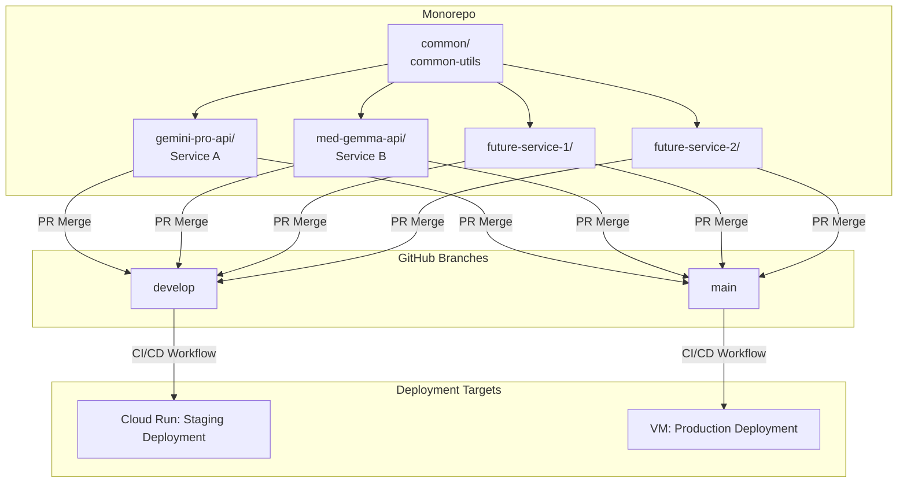

feat/tx-gemma-api
# SUDSS FastAPI Monorepo

This repository follows a **monorepo structure** for managing multiple FastAPI microservices with a shared **common utilities library**. Each service can be **developed, built, and deployed independently** to **Google Cloud Run** using GitHub Actions.


## 📂 Folder Structure


/
├── .github/
│   └── workflows/                # GitHub Actions CI/CD pipelines
│       └── deploy-service-a.yml  # Deployment workflow for Gemini Pro API
│       └── deploy-service-b.yml  # Deployment workflow for Med-Gemma API
│
├── common/                       # Shared code used by all services
│   ├── common_utils/             # Package: common-utils
│   │   ├── __init__.py
│   │   └── helpers.py            # Example: get_timestamp() helper
│   └── setup.py                  # Makes 'common-utils' installable
│
├── gemini-pro-api/               # Service A: Gemini Pro API
│   ├── main.py                   # FastAPI app entrypoint
│   ├── requirements.txt          # Includes -e ../common
│   └── Dockerfile                # Builds image and installs common package
│
└── med-gemma-api/                # Service B: Med-Gemma API
    ├── main.py                   # FastAPI app entrypoint
    ├── requirements.txt          # Includes -e ../common
    └── Dockerfile                # Builds image and installs common package


## 🚀 Deployment Rules

### 1. **Common Package (`common/`)**

* Contains `common-utils` package.
* Installed in development using:

  bash
  pip install -e common
  
* In Docker builds, installed with:

  bash
  pip install /app/common
  


### 2. **Independent Service Deployment**

* **Gemini Pro API (Service A)** → `gemini-pro-api/`
* **Med-Gemma API (Service B)** → `med-gemma-api/`
* Each has its own **requirements.txt** and **Dockerfile**.
* Both services can be deployed independently to Cloud Run.


### 3. **GitHub Actions Workflows**

* Located in `.github/workflows/`.
* Workflows are **path-aware**:

  * `deploy-service-a.yml` runs if **`gemini-pro-api/**` OR `common/**`** changes.
  * `deploy-service-b.yml` runs if **`med-gemma-api/**` OR `common/**`** changes.
* Workflow steps:

  1. Checkout repository.
  2. Authenticate with **Google Cloud** using `GCP_CREDENTIALS`.
  3. Build Docker image (context = repo root, so `common/` is included).
  4. Push image to **Google Artifact Registry**.
  5. Deploy image to **Cloud Run** (`service-a-instance` or `service-b-instance`).


### 4. **Environment & Secrets**

Each workflow uses GitHub secrets:

* `GCP_PROJECT_ID` → Your GCP project ID.
* `GCP_CREDENTIALS` → JSON key of a service account with deploy permissions.
* `GCP_REGION` → Deployment region (e.g. `us-central1`).


### 5. **Runtime**

* Services run with **Uvicorn** on port **8080**:

 bash
  uvicorn main:app --host 0.0.0.0 --port 8080
 
* Cloud Run automatically maps external requests to this port.

### 6. **Architecture Diagram**
mermaid
graph TD
    subgraph Monorepo
        A[common/ <br> common-utils]
        B[gemini-pro-api/]
        C[med-gemma-api/]
    end

    A --> B
    A --> C

    subgraph GitHub["GitHub Branches"]
        F[develop]
        G[main]
    end

    B -->|PR Merge| F
    C -->|PR Merge| F
    F -->|CI/CD Workflow| H[Cloud Run: Staging Deployment]

    B -->|PR Merge| G
    C -->|PR Merge| G
    G -->|CI/CD Workflow| I[VM: Production Deployment]

    subgraph Google Cloud
        H
        I
    end


## ✅ Summary

* **Monorepo structure** keeps shared code and multiple services in sync.
* **Common utilities** are reusable across services.
* **Independent deployments**: changes to one service (or shared code) trigger only the relevant workflow.
* **Google Cloud Run** hosts each service separately with containerized builds.


# SUDSS FastAPI Monorepo

This repository follows a **monorepo structure** for managing multiple FastAPI microservices with a shared **common utilities library**. Each service can be **developed, built, and deployed independently** to **Google Cloud Run** using GitHub Actions.


## 📂 Folder Structure


/
├── .github/
│   └── workflows/                # GitHub Actions CI/CD pipelines
│       └── deploy-service-a.yml  # Deployment workflow for Gemini Pro API
│       └── deploy-service-b.yml  # Deployment workflow for Med-Gemma API
│
├── common/                       # Shared code used by all services
│   ├── common_utils/             # Package: common-utils
│   │   ├── __init__.py
│   │   └── helpers.py            # Example: get_timestamp() helper
│   └── setup.py                  # Makes 'common-utils' installable
│
├── gemini-pro-api/               # Service A: Gemini Pro API
│   ├── main.py                   # FastAPI app entrypoint
│   ├── requirements.txt          # Includes -e ../common
│   └── Dockerfile                # Builds image and installs common package
│
└── med-gemma-api/                # Service B: Med-Gemma API
    ├── main.py                   # FastAPI app entrypoint
    ├── requirements.txt          # Includes -e ../common
    └── Dockerfile                # Builds image and installs common package


## 🚀 Deployment Rules

### 1. **Common Package (`common/`)**

* Contains `common-utils` package.
* Installed in development using:

  ```bash
  pip install -e common
  ```
* In Docker builds, installed with:

  ```bash
  pip install /app/common
  ```


### 2. **Independent Service Deployment**

* **Gemini Pro API (Service A)** → `gemini-pro-api/`
* **Med-Gemma API (Service B)** → `med-gemma-api/`
* Each has its own **requirements.txt** and **Dockerfile**.
* Both services can be deployed independently to Cloud Run.


### 3. **GitHub Actions Workflows**

* Located in `.github/workflows/`.
* Workflows are **path-aware**:

  * `deploy-service-a.yml` runs if **`gemini-pro-api/**` OR `common/**`** changes.
  * `deploy-service-b.yml` runs if **`med-gemma-api/**` OR `common/**`** changes.
* Workflow steps:

  1. Checkout repository.
  2. Authenticate with **Google Cloud** using `GCP_CREDENTIALS`.
  3. Build Docker image (context = repo root, so `common/` is included).
  4. Push image to **Google Artifact Registry**.
  5. Deploy image to **Cloud Run** (`service-a-instance` or `service-b-instance`).


### 4. **Environment & Secrets**

Each workflow uses GitHub secrets:

* `GCP_PROJECT_ID` → Your GCP project ID.
* `GCP_CREDENTIALS` → JSON key of a service account with deploy permissions.
* `GCP_REGION` → Deployment region (e.g. `us-central1`).


### 5. **Runtime**

* Services run with **Uvicorn** on port **8080**:

  ```bash
  uvicorn main:app --host 0.0.0.0 --port 8080
  ```
* Cloud Run automatically maps external requests to this port.


### 6. **Architecture Diagram**



## ✅ Summary

* **Monorepo structure** keeps shared code and multiple services in sync.
* **Common utilities** are reusable across services.
* **Independent deployments**: changes to one service (or shared code) trigger only the relevant workflow.
* **Google Cloud Run** hosts each service separately with containerized builds.

main
